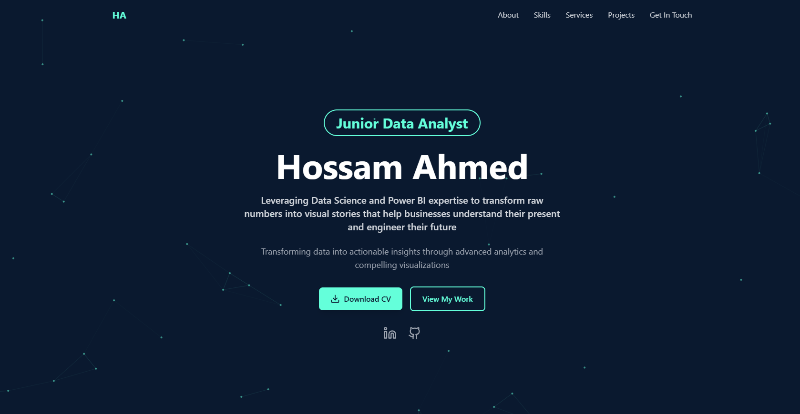

# 🌐 My Portfolio Website

---

## 🖼️ Homepage Preview

👉 **Live Demo:** [hossam-ahmed-portfolio.netlify.app](https://hossam-ahmed-portfolio.netlify.app/)

---

## 📌 Overview
This repository contains the source code for my **personal portfolio website**. It highlights my skills, projects, and professional journey in:
* 📊 **Data Science & Analytics**
* 📈 **Business Intelligence**
* 📉 **Data Visualization & Dashboarding**

---

## ✨ Features
* 🎯 **Professional Introduction** — Summary of expertise and focus areas in Data Science.
* 💼 **Projects Showcase** — Interactive display of completed projects with tech stack details.
* 🛠️ **Skills Section** — Overview of tools like SQL, Python, and Power BI.
* 📱 **Responsive Design** — Fully optimized for desktop, tablet, and mobile devices.
* 📧 **Contact Section** — Direct links to GitHub, LinkedIn, and communication channels.

---

## 🛠️ Tech Stack
* **Frontend:** React.js & Vite.
* **Styling:** Tailwind CSS.
* **Deployment:** Netlify.
